[TOC]

# CentOS下Redis安装与配置

## 一．安装redis
#### 1.下载redis安装包
可去官网 http://redis.io ,也可通过wget命令
```bash
wget http://download.redis.io/releases/redis-4.0.2.tar.gz
```
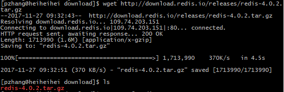
#### 2.解压
```bash
tar -zvxf redis-4.0.2.tar.gz
```
#### 3.编译安装
```bash
cd redis-4.0.2
```
make<br/>

* 如果提示"gcc: Command not found"，需安装gcc;<br/>
* 如果提示"couldn’t execute tcl : no such file or dicrectory", 需安装tcl;<br/>
* 如果提示"zmalloc.h:50:31: error: jemalloc/jemalloc.h: No such file or directory"
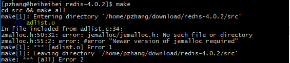<br/>
  需执行make distclean，然后再make<br/>
  或者使用make MALLOC=libc
```bash
make distclean
make MALLOC=libc
```
#### 3.编译安装
* 可手动拷贝src目录下redis-server、redis-cli、redis-check-aof、redis-check-dump等至/usr/local/bin目录下，也可执行make install。此处执行make install<br/>
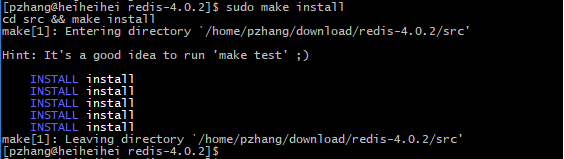<br/>
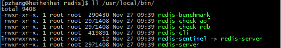<br/>
* 执行redis-server –v，可查看版本
```bash
redis-server –v
```
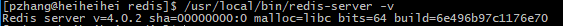<br/>
## 二．修改配置文件
#### 1.创建配置文件目录，dump file 目录，进程pid目录，log目录等
* 配置文件一般放在/etc/下，创建redis目录
```bash
cd /etc/
mkdir redis
```
* dump file、进程pid、log目录等，一般放在/var/目录下
```bash
cd /var/
mkdir redis
cd redis
mkdir data log run
```
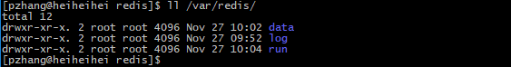<br/>

#### 2.修改配置文件，配置参数
* 首先拷贝解压包下的redis.conf文件至/etc/redis
* 端口<br/>
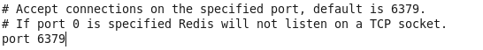
* pid目录<br/>
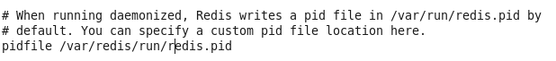
* dump目录<br/>
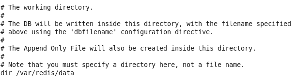
* log存储目录<br/>
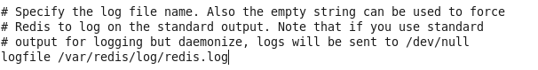
#### 3.持久化
默认rdb，可选择是否开启aof，若开启，修改配置文件appendonly
#### 4.启动redis
```bash
redis-server /etc/redis/redis.conf
```
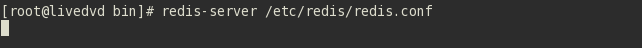<br/>
配置为后台启动<br/>
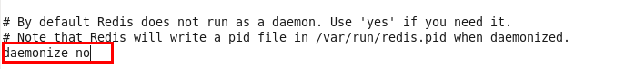<br/>
改成yes
## 三．配置服务

#### 1.创建redis启动脚本
拷贝解压包下utils下redis启动脚本至/etc/init.d/
```bash
cp redis_init_script /etc/init.d/redis
```
修改脚本pid及conf路径为实际路径<br/>
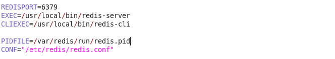
* 至此，在/etc/init.d/目录下，已经可以通过service redis start/stop 命令启动和关闭redis
#### 2.配置脚本执行权限
```bash
chmod +x /etc/init.d/redis
```
#### 3.设置自启动
```bash
chkconfig redis on
```